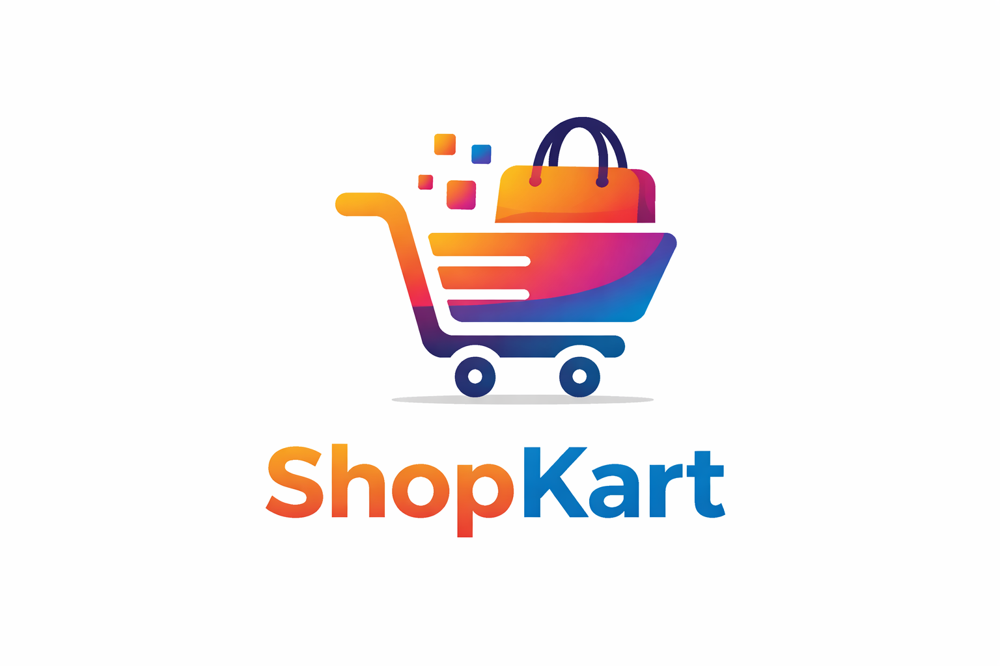

# ShopKart - Modern E-commerce Platform

<p align="center">
  
</p>

<div align="center">

[](https://opensource.org/licenses/MIT)
[](https://nodejs.org/)
[](https://reactjs.org/)
[](https://www.mongodb.com/)

</div>

**ShopKart** is a cutting-edge e-commerce platform built with the MERN stack, featuring a seamless shopping experience, advanced admin controls, and integrated payment processing. This full-stack application demonstrates modern web development practices with a focus on user experience and scalability.

---

## ✨ Key Features

### 🛍️ **For Customers**
- **Intuitive Shopping Experience**: Clean, responsive interface with smooth navigation
- **Product Discovery**: Advanced filtering, search, and category browsing
- **Secure Checkout**: Multi-step checkout process with address management
- **Payment Integration**: Razorpay-powered secure payment gateway
- **Order Tracking**: Real-time order status updates
- **User Profiles**: Personalized accounts with order history
- **Wishlist Management**: Save favorite products for later

### 👑 **For Admins**
- **Dashboard Analytics**: Comprehensive sales and user statistics
- **Order Management**: Real-time order tracking with status updates
- **Product Management**: Full CRUD operations for product catalog
- **Customer Management**: View and manage customer accounts
- **Inventory Control**: Stock level monitoring and management

### 🔐 **Security & Authentication**
- **JWT Authentication**: Secure token-based authentication
- **Role-based Access**: Separate customer and admin privileges
- **Password Encryption**: Bcrypt-encrypted passwords
- **Session Management**: Secure session handling

---

## 🚀 Live Demo

**[Live Application Link](https://shopkart-ecommerce.netlify.app)**

> *Note: The live demo may have limited functionality. For full experience, run locally.*

---

## 🛠️ Tech Stack

| Technology | Purpose |
|------------|---------|
| **React.js** | Frontend framework |
| **Node.js** | Backend runtime |
| **Express.js** | Backend framework |
| **MongoDB** | Database |
| **Mongoose** | ODM |
| **Razorpay** | Payment processing |
| **Tailwind CSS** | Styling framework |
| **Lucide React** | Icon library |
| **React Router** | Client-side routing |

---

## 📦 Project Structure

```
Ecommerce-app/
├── client/                    # Frontend React application
│   ├── public/               # Static assets
│   ├── src/
│   │   ├── components/       # Reusable UI components
│   │   ├── pages/           # Page components
│   │   ├── context/         # React Context providers
│   │   └── App.jsx          # Main application component
│   └── package.json
├── server/                   # Backend Express application
│   ├── config/              # Database configuration
│   ├── controllers/         # Business logic
│   ├── middleware/          # Authentication & authorization
│   ├── models/              # Mongoose models
│   ├── routes/              # API routes
│   └── server.js            # Server entry point
└── README.md
```

---

## 🚀 Getting Started

### Prerequisites

- Node.js (v14 or higher)
- MongoDB (local or cloud instance)
- npm or yarn package manager

### Installation

1. **Clone the repository**
```bash
git clone https://github.com/yourusername/ecommerce-app.git
cd ecommerce-app
```

2. **Install dependencies**
```bash
# Install backend dependencies
npm install
cd client && npm install
```

3. **Set up environment variables**
Create a `.env` file in the `server/` directory:
```env
PORT=5000
MONGODB_URI=your_mongodb_connection_string
JWT_SECRET=your_jwt_secret
RAZORPAY_KEY_ID=your_razorpay_key
RAZORPAY_KEY_SECRET=your_razorpay_secret
```

4. **Run the application**
```bash
# Start backend server
npm run dev

# In another terminal, start frontend
cd client && npm start
```

---

## 🎯 Core Functionalities

### **Authentication System**
- User registration with email verification
- Secure login/logout functionality
- Password reset capability
- Role-based access control (Admin/Customer)

### **Shopping Experience**
- Browse products by category
- Product search and filtering
- Detailed product views with specifications
- Shopping cart management
- Wishlist functionality
- Responsive design for all devices

### **Checkout Process**
- Multi-step checkout flow
- Address management
- Payment processing via Razorpay
- Order confirmation and tracking

### **Admin Panel**
- Real-time order management
- Product inventory control
- Sales analytics and reporting
- Customer management
- Order status updates with real-time notifications

---

## 💳 Payment Integration

The application integrates with **Razorpay** for secure payment processing:
- Test and production environments supported
- Secure transaction handling
- Payment confirmation and order creation
- Comprehensive error handling

---

## 📊 Database Schema

### **User Model**
- Name, Email, Password (hashed)
- Admin status, Account creation date
- Profile picture, Loyalty points

### **Product Model**
- Title, Description, Price
- Images, Category, Rating
- Stock availability, Specifications

### **Order Model**
- User reference, Product list
- Address, Payment method, Status
- Order date, Total amount

---

## 🎨 UI/UX Highlights

- **Responsive Design**: Works seamlessly on mobile, tablet, and desktop
- **Modern Interface**: Clean, intuitive user interface
- **Performance Optimized**: Fast loading times and smooth interactions
- **Accessibility**: WCAG compliant design
- **User Journey Focused**: Intuitive navigation and clear CTAs

---

## 🧪 Testing

- Unit tests for critical business logic
- Integration tests for API endpoints
- Frontend component testing
- End-to-end testing for user flows

---

## 🚀 Deployment

### **Backend (Heroku/Render/DigitalOcean)**
1. Push code to GitHub
2. Configure buildpacks (Node.js)
3. Set environment variables
4. Deploy and scale

### **Frontend (Netlify/Vercel)**
1. Build React application: `npm run build`
2. Deploy static files
3. Configure custom domain if needed

---

## 🤝 Contributing

We welcome contributions to make this project even better!

1. Fork the repository
2. Create a feature branch: `git checkout -b feature/amazing-feature`
3. Commit changes: `git commit -m 'Add amazing feature'`
4. Push to branch: `git push origin feature/amazing-feature`
5. Open a Pull Request

---

## 📄 License

This project is licensed under the MIT License - see the [LICENSE](LICENSE) file for details.

---

## 📞 Support

For support, please contact:
- **Email**: someshbhatnagar535@example.com
- **GitHub Issues**: [Submit an issue](https://github.com/yourusername/ecommerce-app/issues)

---

## 👨‍💻 About the Developer

**Somesh Bhatnagar** - Full Stack Developer passionate about creating modern web applications with exceptional user experiences.

<a href="https://www.linkedin.com/in/somesh-bhatnagar-18b388328/">
  
</a>
<a href="https://www.instagram.com/bhatnagarsomesh/">
  
</a>
<a href="https://github.com/someshcoder">
  
</a>

---

<div align="center">

⭐ **Star this repository if you find it helpful!** ⭐

</div>